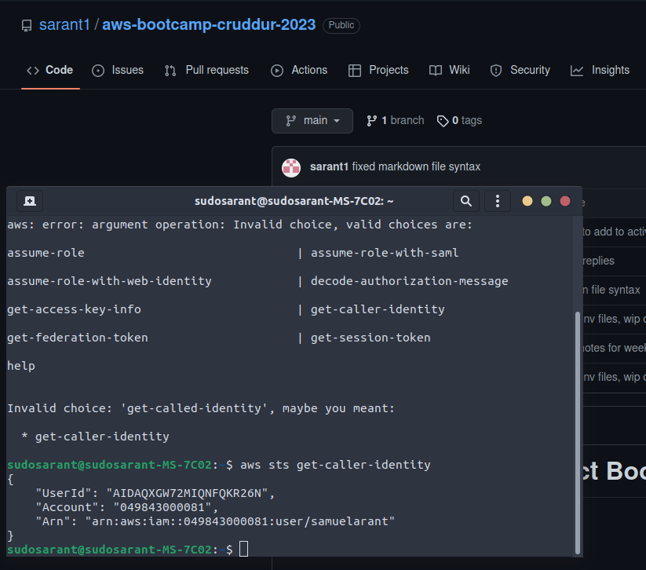

# Week 0 — Billing and Architecture

## Spend Notes  

- Pricing varies between regions.
    
### Billing Resource(FREE):
-  **Bills** - You can check month by month resources used and cost
- **Free Tier** - Allows you to monitor your Free tier usage
- **Billing preferences** - Allows you to set an email address to send billing alerts to

#### CloudWatch Alarm (FREE Tier up to 10):
- Region has to be set to N. Virginia
- Allows you to set a more customized alarm, You use SNS to send alert (10 alarms free in Free Tier)
#### Cost Allocation Tags (important in real world)(FREE):
- You can set tags to resources and then track the total cost of all the resoures that utilize that tag
#### Cost Explorer (FREE):
- Allows you to  view data on spend via graphs and filters
####  AWS Calculator (FREE):
- Calculates amount for 730 hours, The actual cost will depend on month and total amount of hours

## Security Notes 

#### Cyber security goal? 
Inform a business on any tech risk that a business may be exposed to - Make sure the business is INFORMED on the RISK
#### What is cloud security ? 
Protecting data within a app hosted on the Cloud
#### Why should we care? 
AWS account gets compromised => could have huge impact if not properly set up
#### Automation => good! 
helps prevent human error
#### HACKERS! - starting to get into cloud and using AI for hacking

#### AWS Organizations (FREE):
- account segregation is the highest level of segration example, this allows the seperations of environments
- Helps you manage billing, security, and managing.
- Leave management account seperate from any resources

#### AWS CloudTrail ($$):
- MOST things will be reported to Cloud Trail
- monitoring data (ensuring it is in the right place)
- You can store trail data in S3 ($$)
- Data Events Config($$)
- Insight Events Config($$)
#### IAM (FREE):
- Enable MFA for all Human Users
- 3 Kinds of users:
    1. AWS IAM User
    2. System Users, can be attached to a system
    3. Federated Users, SAML
- IAM Roles vs IAM Policy:
    - IAM Policy can be attached to a group of users, individual, admin role
    - Essentially a policy is attached to a role, resource,etc to give it permissions

#### AWS Organizations and SCP(Service Control Policy):
- Use SCP to give permmissions to users within an organization (TIP: Use least privilege model)
    - Examples: prevent users from leaving an organization
- You Attach SCP to organizational accounts
#### AWS GuardDuty ($$):
- Threat detection service for AWS

##### TOP 5 Cloud Security Practices!
- **Data Protection & Residency in accordance to Security Policy** - The data should be stored in the country that it makes sense to be stored in
- **IAM with Least Privilege** - Give users just enough permissions to do their job
- **Governance & Compliance of AWS Services being used** - Understand local laws and regulation with data (Global vs Regional)
- **Shared Responsiblity of Threat Detection** - AWS can show what can be done, your job is to implement and do what can be done
- **Incident Response Plans to include Cloud** - Continue to update incident response

## Link to my Conceptual Diagram that I built during the Saturday livestream!

[My Concept Diagram Link](https://lucid.app/lucidchart/d98638dd-26a3-41d9-9da7-b9f6ce5c3ae7/edit?viewport_loc=-345%2C-108%2C2212%2C977%2C0_0&invitationId=inv_11a472ce-bc07-4b23-9b84-33caff3806d7)

## Link to my Logical Architectual Diagram!

[My Logical Diagram Link](https://lucid.app/lucidchart/cb278a33-5ff1-4613-af80-d545c8670e8a/edit?viewport_loc=-678%2C-1354%2C3318%2C1466%2C0_0&invitationId=inv_d5d3fa2f-31cc-435c-84b3-2b6bb0bf4616)

## Proof of AWS CLI installed

