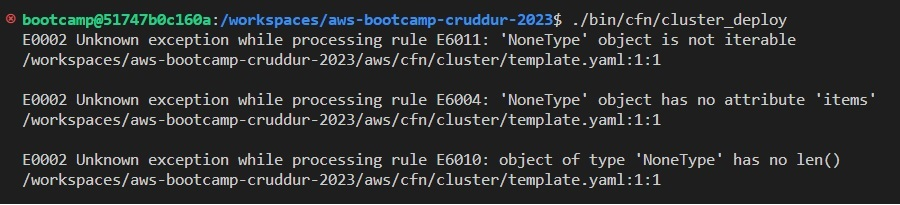

# Week 10 — CloudFormation Part 1

## Livestream Notes
- 3 tier architecture (ex: Web tier, app tier, database tier)
- Cloudformation use smaller sections to save time when having to re provision them if they fail.

My Lucid Chart for networking:
https://lucid.app/lucidchart/a753709e-2d6f-4313-9d42-1ea87fde69fd/edit?view_items=gZWRLAi3EmBS&invitationId=inv_96c0aa6b-8f93-4f98-840e-5d4fe4755209

## Debugging

Getting these erros with cloudformation

I fixed it but I forget what the problem was :/

- I was misconfigured my ALB listeners so I had to fix some spelling mistakes Forward => forward & HTTPS => HTTP (for HTTP listener)